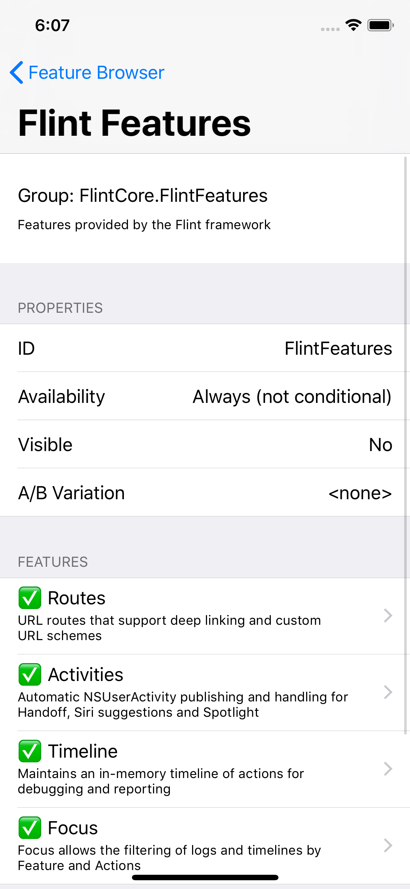
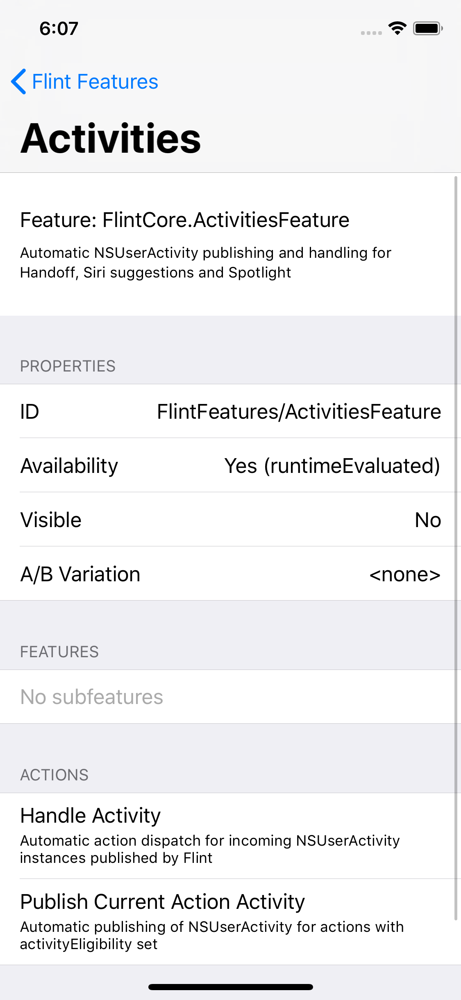
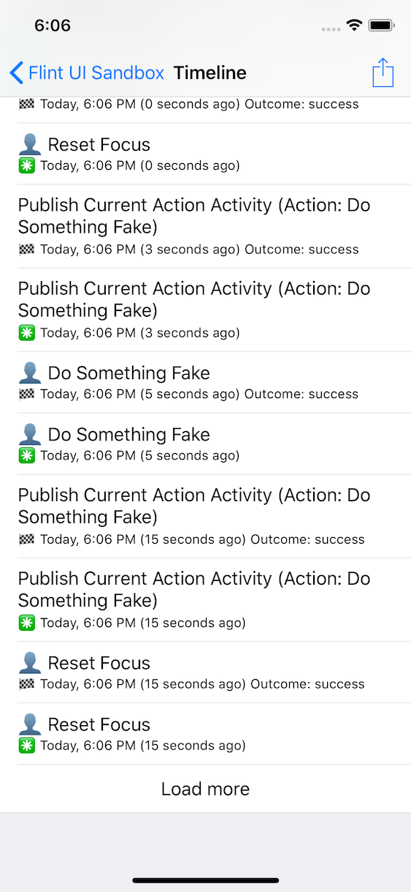
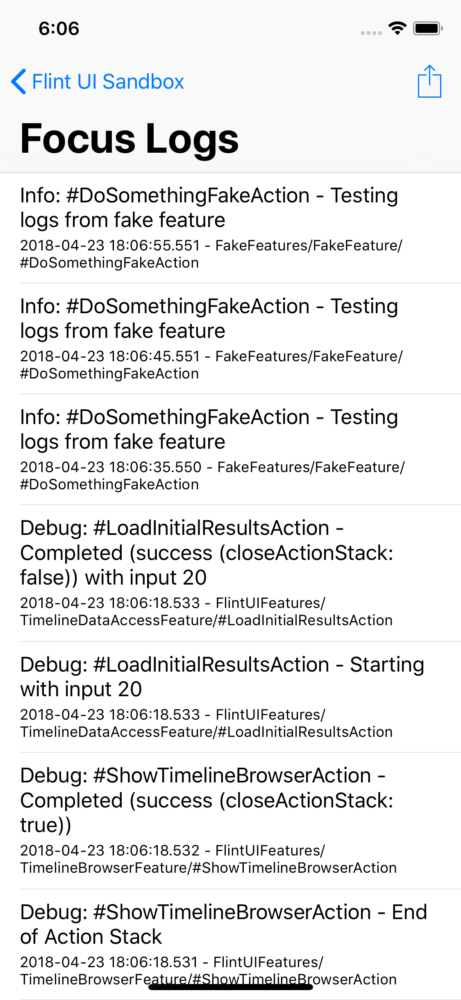
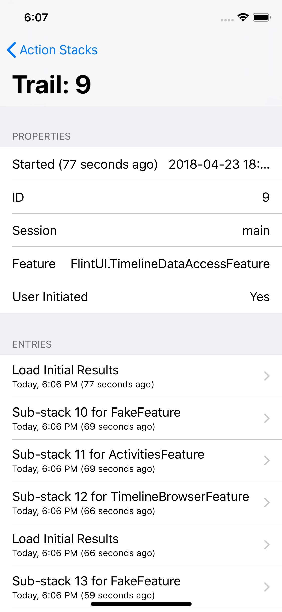

## Overview

We provide a set of powerful tools for looking inside your Flint-based app on iOS to verify that your Features and Actions are set up correctly, to browse Timeline and Focus logs for problems, generate debug reports and so on.

Once again FlintUI uses Flint itself to expose its features. Dogfooding through and through!

## Registering the FlintUI features

The FlintUI framework supplies its debug UI capabilities as Flint features, so you need to register these with Flint when you are setting up Flint itself in your application delegate or other entry point. You'll need to import FlintUI too:

```swift
import FlintCore
import FlintUI

...

func application(_ application: UIApplication, didFinishLaunchingWithOptions launchOptions: [UIApplicationLaunchOptionsKey: Any]?) -> Bool {
    Flint.quickSetup(FakeFeatures.self, domains: [], initialDebugLogLevel: .debug, initialProductionLogLevel: .info)

    // Add the FlintUI features
    Flint.register(FlintUIFeatures.self)
    ...
}
```

## The Feature Browser

This feature allows you to drill down into the hierarchy of all Feature(s) declared in your app and into their Action declarations. This is useful for debugging and verifying your code has set everything up correctly. You can also see which features are currently enabled in a given build and user profile.

{:width="300px"}
{:width="300px"}

To use the feature browser, just perform the show action from a `UIViewController`:

```swift
import UIKit
import FlintUI

...

@IBAction func userTappedYourDebugButton(_ sender: Any) {
	FeatureBrowserFeature.show.perform(using: self)
}
```

## The Timeline Browser

This feature will show the current contents of the Timeline so that you can see what actions the user has performed, and drill down into their details, showing the inputs and related properties.

{:width="300px"}

The display will update in realtime if actions continue to be performed, although usually this won’t happen unless you have some long-running or background actions. It is feasible to show this view controller embedded in another, or using a split view on iPad, so that you can see realtime updates.

To use it, just perform the show action from a `UIViewController`:

```swift
if let request = TimelineBrowserFeature.show.request() {    
   request.perform(with: self)
}
```

Note that the Flint `TimelineFeature` must be available for the UI to be available.

## The Focus Log Browser

This feature will show you the contents of the current Focus logging, in real time. By default this would include all contextual logging going through Flint but using the Focus feature you can restrict this at runtime to one or more features that you are interested in debugging.

{:width="300px"}

To use it, just perform the show action from a `UIViewController`:

```swift
if let request = LogBrowserFeature.show.request() {    
    request.perform(using: self)
}
```

Note that the Flint `FocusFeature` must be available for the UI to be available.

## The Action Stack Browser

This feature allows you to see the current snapshot of the active action stacks in the app, broken down by session and the originating feature that started the stack.

You can drill down into the stacks to see what actions have occurred so far on them, including into sub-stacks where the user started using a different feature.

{:width="300px"}

To use it, just perform the show action from a `UIViewController`:

```swift
ActionStacksBrowserFeature.show.perform(using: self)
```


