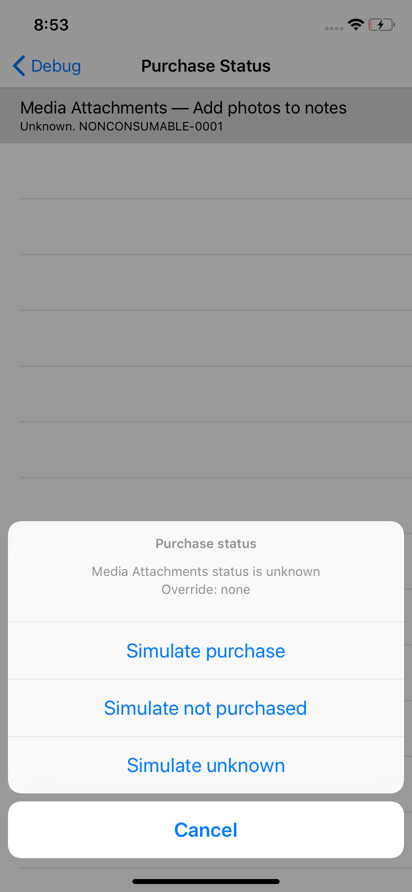
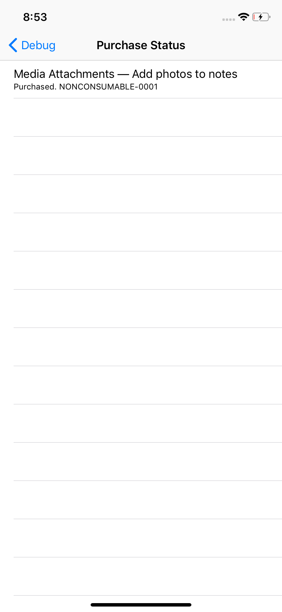

#### In this article:
{:.no_toc}
* TOC
{:toc}

## Overview

Flint allows you to define [`Conditional Features`](conditional_features.md) that among other constraints, can require one or more purchases before they will be available for use.

The information about which purchases are confirmed is provided by an implementation of [`PurchaseTracker`](https://github.com/MontanaFlossCo/Flint/blob/master/FlintCore/Purchases/PurchaseTracker.swift) assigned to the [`Flint.purchaseTracker`](https://github.com/MontanaFlossCo/Flint/blob/master/FlintCore/Core/Flint.swift) property.

By default, Flint will create an instance of `StoreKitPurchaseTracker` if you do not assign one yourself. This is a basic implementation that will observe the StoreKit payment queue for information about transactions.

Whether or not you provide your own `PurchaseTracker` implementation, you can use `DebugPurchaseTracker` instance to wrap your real tracker, so that you can easily override purchase status during testing.

Flint also provides a debug UI for iOS that lets you easily view and override the status of purchases used by the Features in your app.

## Using StoreKitPurchaseTracker

This tracker observes the purchase queue and stores the transaction status of products in a JSON file on the device. There is no receipt validation in this implementation.

By default, the StoreKit purchase tracker will be used. You have nothing else to do. Define requird purchases for your features something like this:

```swift
import FlintCore

enum MyInAppPurchases {
    static let attachments = Product(name: "Media Attachments",
                                     description: "Add photos to notes",
                                     productID: "NONCONSUMABLE-0001")
}

final class PhotoAttachmentsFeature: ConditionalFeature {
    static func constraints(requirements: FeatureConstraintsBuilder) {
        requirements.iOSOnly = 10
        
        requirements.permissions(.photos, .camera)
        requirements.permission(.contacts(entity: .contacts))
        
        requirements.purchase(MyInAppPurchases.attachments)
    }

    ...
}
```

Once you do this and run your code, the feature will be disabled unless you have purchased the product with ID `NONCONSUMABLE-0001`. You can see the status of the purchases using the debug UI, described in the next section.

If you are developing an app with Extensions that also require access to the information about active purchases, you must assign your app's shared group container ID to `FlintAppInfo.appGroupIdentifier` at startup.

**NOTE**: If you really need receipt validation you can implement this yourself, as recommended by Apple. Our philosophy is that the out of the box experience should be simple for developers, and people who go to the effort to hack their devices or tamper with your app's files are never going to pay you whatever you do. You may disagree, and you can channel that energy into your own implementation — but you should also take care to ensure it is not trivial for hackers to bypass Flint's logic for feature availability. This notwithstanding, kust implement your own `PurchaseTracker` and assign it to `Flint.purchaseTracker` at start up and you're good to go.

## Adding the Purchase Browser debug UI for iOS

Adding the `FlintUI` dependency to your app, you can then use the `PurchaseBrowserFeature` to show a view controller which will show purchase status:

{:width="300px"}

If you have used the debug purchase tracker, you can also tap purchases and override their current status to faake the purchase, non-purchase or "unknown" status of each purchase.

## Adding the DebugPurchaseTracker for runtime toggling of purchase status

The debug tracker can be used standalone without a real tracker — useful for developing your purchase-based UI and testing how your feature/purchase gating feels — or you can use it to proxy a real tracker and provide runtime overrides for the actual purchase status of your active Apple ID.

{:width="300px"}
{:width="300px"}

To use the debug tracker to proxy the store tracker, you do something like this before setting up Flint in your app delegate:

```swift
let storeKitTracker = try! StoreKitPurchaseTracker(appGroupIdentifier: FlintAppInfo.appGroupIdentifier)
Flint.purchaseTracker = DebugPurchaseTracker(targetPurchaseTracker: storeKitTracker)
```

That's all there is to it!

## Next steps

* Using [Flint UI](flint_ui.md) for development debugging tools
